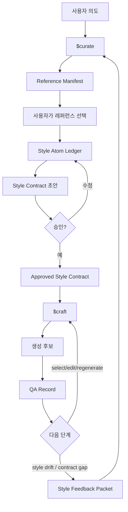

# chuu-gumi Codex Skill Pack


[English README](./README.md)

GPT Image 2 기반의 순환형 시각 에셋 생성을 위한 프로젝트 로컬 Codex 스킬 팩입니다. 시스템은 `artifacts/state.yaml`에 현재 상태를 명시하고, `$curate`는 style memory와 Style Contract 변경을 담당하며, `$craft`는 승인된 계약 기반 에셋 생성과 QA를 담당합니다.

## 빠른 시작

이 저장소를 Codex workspace로 엽니다. Codex는 `.agents/skills`에서 repo-local skill을 발견해야 합니다.

```text
$curate
<원하는 시각 방향 설명>
레퍼런스 후보를 생성하고 Reference Manifest를 반환한 뒤, 제가 후보 ID를 선택할 때까지 멈추세요.
```

그 다음:

```text
$curate
R02, R05, R07을 사용하세요.
선택된 레퍼런스만 분석하고, style atom을 만들고, Style Contract 초안을 작성하세요.
```

승인 뒤:

```text
$craft
현재 승인된 Style Contract를 사용하세요.
에셋 요청: <만들 에셋 설명>
후보를 생성하고 계약 기준으로 QA하세요.
```

## 구조

```text
.agents/skills/       repo-local Codex skills
.codex/agents/        선택적 specialist subagents
artifacts/state.yaml  현재 workflow phase와 artifact pointer
artifacts/            references, contracts, generations, QA 상태 저장소
docs/                 architecture, schemas, usage, validation
scripts/              static validation helpers
```

## 아키텍처



## 문서

- [작동 원리](./docs/how-it-works.ko.md)
- [Architecture](./docs/architecture.md)
- [Schemas](./docs/schemas.md)
- [Usage](./docs/usage.md)
- [Validation](./docs/validation.md)
- [Artifact State](./artifacts/README.md)

정적 검증:

```bash
scripts/validate-static.sh
```

## 규칙

- 글로벌 설치는 필요 없습니다.
- GPT Image 2를 기본 이미지 생성 capability로 사용합니다. 사용할 수 없으면 다른 모델로 조용히 대체하지 말고 blocked manifest를 반환합니다.
- 승인된 Style Contract는 수정하지 않습니다.
- `curate`가 style memory와 contract revision을 담당합니다.
- `craft`는 승인된 계약을 읽기 전용으로 취급합니다.
- style drift와 contract gap은 feedback으로 `curate`에 되돌립니다.
- 프로젝트명, 장르명, 스타일명, 설정 서사, 출력 경로, 에셋 분류 체계를 임의로 만들지 않습니다.

## 참고

- [OpenAI Codex Skills docs](https://developers.openai.com/codex/skills)
- [OpenAI Codex Subagents docs](https://developers.openai.com/codex/subagents)
- [openai/skills](https://github.com/openai/skills)
- [ComposioHQ/awesome-codex-skills](https://github.com/ComposioHQ/awesome-codex-skills)
- [proflead/codex-skills-library](https://github.com/proflead/codex-skills-library)
- [hoavdc/CodexKit](https://github.com/hoavdc/CodexKit)
