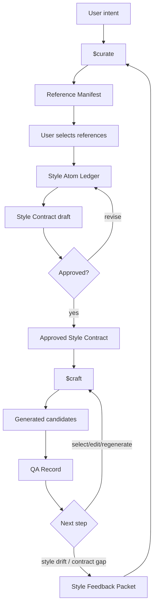

# chuu-gumi Codex Skill Pack


[한국어 문서](./README.ko.md)

Project-local Codex skills for cyclic visual asset generation with GPT Image 2. The system keeps explicit state in `artifacts/state.yaml`, uses `$curate` for style memory and Style Contract changes, and uses `$craft` for approved-contract asset generation and QA.

## Quick Start

Open this repository as the Codex workspace. Codex should discover skills from `.agents/skills`.

```text
$curate
<describe the visual direction>
Generate reference candidates, return a Reference Manifest, and stop for my candidate selection.
```

Then:

```text
$curate
Use R02, R05, and R07.
Analyze only those selected references, create style atoms, and draft a Style Contract.
```

After approval:

```text
$craft
Use the current approved Style Contract.
Asset request: <describe the asset>
Generate candidates and QA them against the contract.
```

## Structure

```text
.agents/skills/       repo-local Codex skills
.codex/agents/        optional specialist subagents
artifacts/state.yaml  current workflow phase and artifact pointers
artifacts/            durable state: references, contracts, generations, QA
docs/                 architecture, schemas, usage, validation
scripts/              static validation helpers
```

## Architecture



## Documentation

- [How It Works (Korean)](./docs/how-it-works.ko.md)
- [Architecture](./docs/architecture.md)
- [Schemas](./docs/schemas.md)
- [Usage](./docs/usage.md)
- [Validation](./docs/validation.md)
- [Artifact State](./artifacts/README.md)

Run static validation:

```bash
scripts/validate-static.sh
```

## Rules

- No global install is required.
- GPT Image 2 is the default image-generation capability; if unavailable, return a blocked manifest instead of silently substituting another model.
- Approved Style Contracts are immutable.
- `curate` owns style memory and contract revisions.
- `craft` treats the approved contract as read-only.
- Style drift and contract gaps return to `curate` as feedback.
- Do not invent project names, genre labels, style names, lore, output paths, or asset taxonomies.

## References

- [OpenAI Codex Skills docs](https://developers.openai.com/codex/skills)
- [OpenAI Codex Subagents docs](https://developers.openai.com/codex/subagents)
- [openai/skills](https://github.com/openai/skills)
- [ComposioHQ/awesome-codex-skills](https://github.com/ComposioHQ/awesome-codex-skills)
- [proflead/codex-skills-library](https://github.com/proflead/codex-skills-library)
- [hoavdc/CodexKit](https://github.com/hoavdc/CodexKit)
