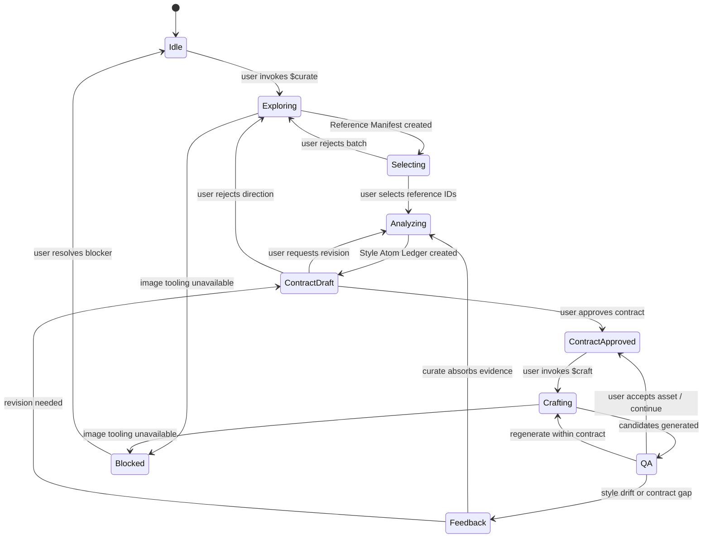
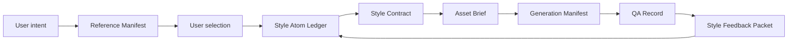

# Architecture

This repository defines a project-local Codex system for cyclic visual asset work using the available Codex image-generation capability. The core design is a state machine, not a linear pipeline.

## Layers

```text
.agents/skills/     user-facing workflows
.codex/agents/      optional specialist subagents
artifacts/          durable workflow state
docs/               architecture, schemas, usage, validation
scripts/            deterministic static validation helpers
```

## State Machine



## Responsibility Boundaries

| Layer | Owns | Must not do |
| --- | --- | --- |
| `curate` skill | reference exploration, user selection gates, style atoms, Style Contract drafts and revisions | generate production assets as if style were approved |
| `craft` skill | Asset Briefs, prompt packages, candidate generation, QA, feedback packets | revise or approve Style Contracts |
| `curator` agent | optional deep analysis and contract revision proposals | bypass user approval |
| `crafter` agent | optional asset-production planning and QA delegation | mutate style memory |
| `style-reviewer` agent | optional independent review | silently fix artifacts without instruction |
| `artifacts/state.yaml` | current phase and active pointers when durable state exists | replace artifact content |

Image generation steps use the available Codex image-generation capability. The workflow records the generation tool and model when the environment reports them, and does not assert a specific model name when it is not exposed. Hand-authored SVG, vector, HTML/CSS, canvas, and other code-native placeholders are not valid generated candidates. If image generation is unavailable or fails, the workflow enters `blocked` and returns a blocked manifest rather than inventing image outputs.

## Evidence Flow



Evidence can move forward only through explicit artifacts. Generated asset QA is evidence, not a style rule. It becomes a contract change only after `curate` classifies it and the user approves a draft revision.

## Why This Shape

- Codex skills are the simplest repo-local user interface for `$curate` and `$craft`.
- Custom agents are optional because Codex subagents are explicit delegation, not default invocation.
- Artifacts keep state across turns and make user decisions auditable.
- The state pointer prevents the workflow from relying on chat memory alone.
