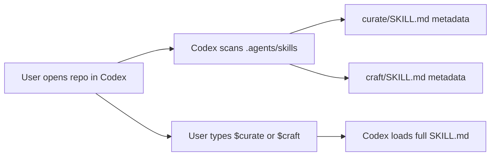
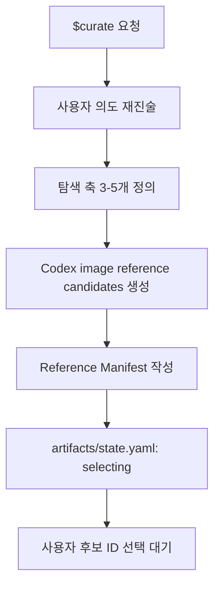
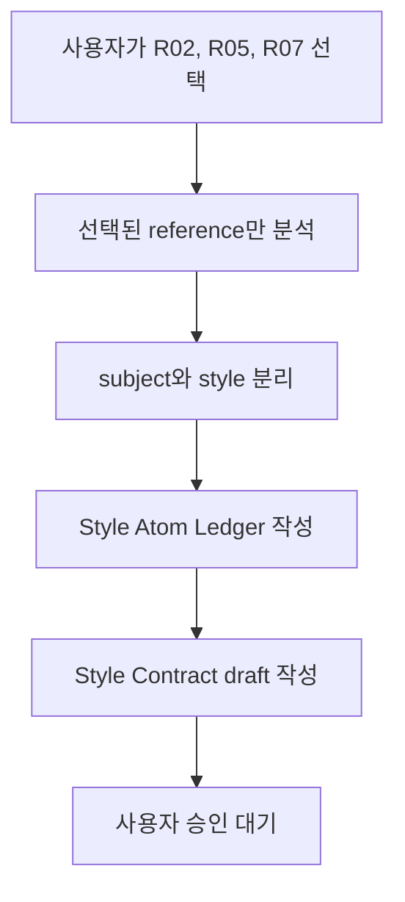
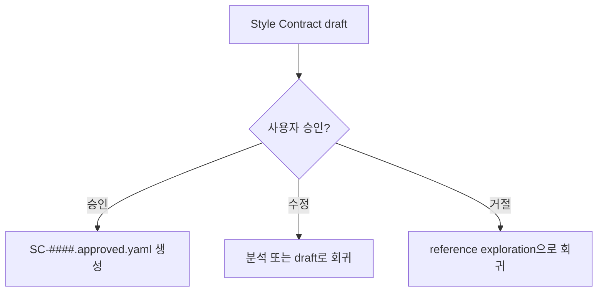
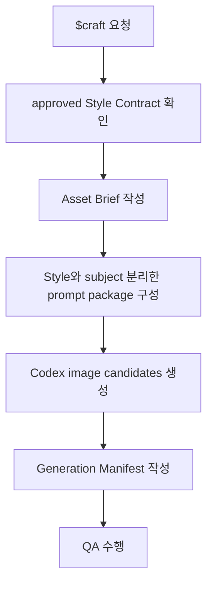
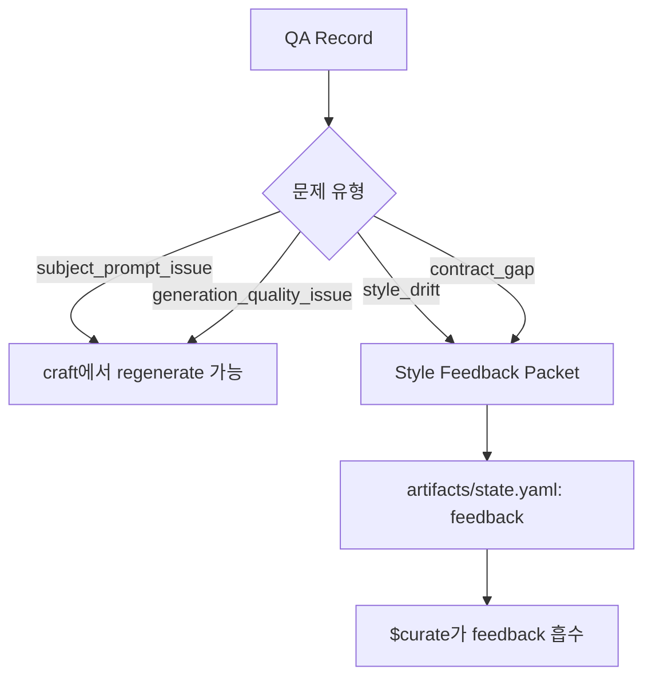
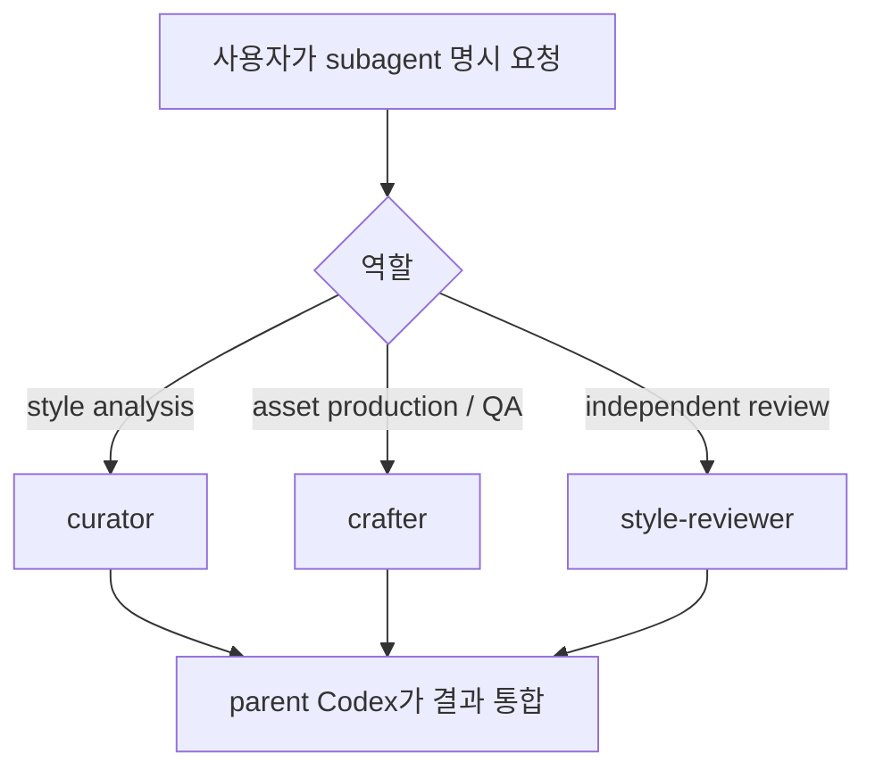
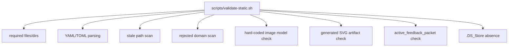
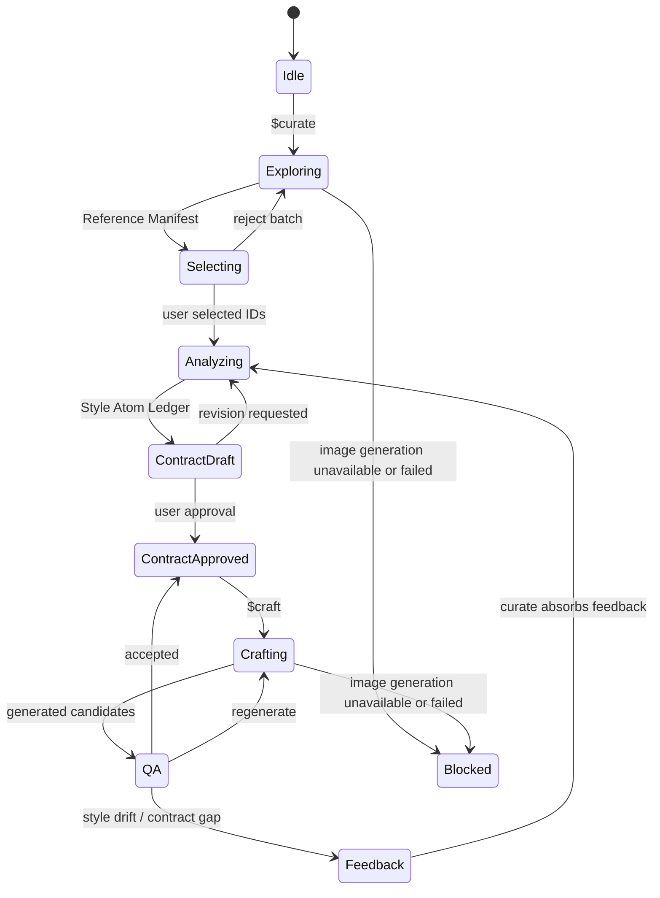

# How It Works

이 문서는 chuu-gumi Codex Skill Pack이 왜 지금 구조로 동작하는지 설명합니다. 목표는 사용자가 `$curate`와 `$craft`를 실행했을 때 Codex가 어떤 파일을 읽고, 어떤 상태를 바꾸고, 왜 특정 지점에서 멈추는지 이해하는 것입니다.

## 한 줄 요약

이 시스템은 두 개의 repo-local skill과 하나의 상태 포인터로 움직입니다.

```text
$curate = 스타일 기준을 만들고 개정하는 workflow
$craft  = 승인된 스타일 기준으로 에셋을 만들고 QA하는 workflow
artifacts/state.yaml = 필요할 때 생성되는 현재 phase와 활성 artifact 상태 포인터
```

## 근거가 되는 Codex 원리

Codex 공식 문서 기준으로 skill은 `SKILL.md`가 있는 디렉터리이며, optional `references/`, `scripts/`, `assets/`, `agents/openai.yaml`를 가질 수 있습니다. Codex는 명시 호출(`$skill`) 또는 description 기반 implicit matching으로 skill을 활성화합니다. repo-local skill은 `.agents/skills`에서 발견됩니다.

이 저장소가 `.agents/skills/curate`와 `.agents/skills/craft`를 쓰는 이유가 이것입니다.

Subagent는 다릅니다. Codex는 사용자가 명시적으로 요청할 때만 subagent를 spawn합니다. custom agent는 `.codex/agents/*.toml`에 정의하며 `name`, `description`, `developer_instructions`가 필수입니다. 그래서 이 저장소의 `curator`, `crafter`, `style-reviewer`는 기본 실행 경로가 아니라 선택적 specialist입니다.

이미지 생성은 현재 Codex 환경에서 사용 가능한 image-generation capability를 사용합니다. 도구가 generation tool이나 model 이름을 알려주면 manifest에 기록하고, 알려주지 않으면 특정 모델명을 단정하지 않습니다. 손으로 작성한 SVG, vector, HTML/CSS, canvas, code-native placeholder는 생성 후보로 인정하지 않습니다. 이미지 생성 도구가 없거나 호출이 실패하면 blocked manifest를 반환합니다.

## 판단 근거 요약

| 설계 결정 | 이유 | 근거 |
| --- | --- | --- |
| `.agents/skills/curate`, `.agents/skills/craft`를 repo-local skill로 둠 | 글로벌 설치 없이 현재 workspace에서 바로 발견되게 하기 위해서입니다. | Codex Skills 문서는 repo scope skill을 `.agents/skills`에서 스캔한다고 설명합니다. |
| skill 본문은 `SKILL.md`, 세부 schema는 `references/`와 `docs/`로 분리 | Codex가 처음에는 metadata만 보고, 선택된 skill의 전문만 읽는 progressive disclosure 구조이기 때문입니다. | Codex Skills 문서는 skill이 `SKILL.md`와 optional `references/`, `scripts/`, `assets/`, `agents/openai.yaml`를 가질 수 있다고 설명합니다. |
| subagent는 기본 실행 경로가 아니라 선택 옵션 | subagent는 병렬 specialist 작업에는 유리하지만, 명시 요청이 필요하고 토큰/시간 비용이 늘어납니다. | Codex Subagents 문서는 subagent가 명시 요청 시 spawn되며 각 subagent가 별도 model/tool work를 수행한다고 설명합니다. |
| Style Contract 승인 전에는 `$craft`를 막음 | 제작 기준이 흔들리면 에셋마다 다른 스타일 기준이 적용될 수 있기 때문입니다. | 이 부분은 Codex 공식 규칙이 아니라 이 workflow의 도메인 규칙입니다. `docs/schemas.md`의 promotion rule과 `artifacts/state.yaml`의 phase pointer가 근거입니다. |
| image generation unavailable/failure 시 blocked manifest 반환 | 생성 결과가 없는데 이미지 path, QA, visual read를 꾸며내면 이후 Style Contract evidence가 오염되기 때문입니다. SVG 같은 code-authored placeholder도 생성 결과로 인정하지 않습니다. | 이 workflow의 artifact schema와 validation rule이 근거입니다. |

## 레이어 구조

```text
.agents/skills/
  curate/      사용자-facing 스타일 큐레이션 workflow
  craft/       사용자-facing 에셋 제작 workflow

.codex/agents/
  curator.toml         선택적 심층 스타일 분석 agent
  crafter.toml         선택적 에셋 제작/QA agent
  style-reviewer.toml  선택적 독립 리뷰 agent

artifacts/
  state.yaml           필요할 때 생성되는 현재 workflow 상태 포인터
  style/               레퍼런스, style atoms, contracts, decisions
  assets/              briefs, generations, QA, feedback

docs/
  architecture.md      전체 구조
  schemas.md           artifact naming과 schema
  usage.md             사용 예시
  validation.md        검증 절차
```

## Flow 0. Skill Discovery



### 왜 이렇게 동작하나

Codex는 skill 목록을 처음부터 모두 전문으로 읽지 않고, `name`, `description`, file path 같은 얇은 metadata를 먼저 봅니다. 실제 skill이 선택되면 그때 `SKILL.md` 본문을 읽습니다. 이 progressive disclosure 구조 때문에 `SKILL.md`는 workflow의 핵심 지시만 담고, 자세한 schema는 `references/contracts.md`와 `docs/schemas.md`로 분리했습니다.

### 관련 파일

```text
.agents/skills/curate/SKILL.md
.agents/skills/craft/SKILL.md
.agents/skills/*/agents/openai.yaml
```

## Flow 1. `$curate` Reference Exploration



### 왜 여기서 멈추나

스타일 기준은 agent가 혼자 확정하면 drift가 생기기 쉽습니다. 사용자가 선택한 레퍼런스만 style evidence가 되도록 해야 합니다. 그래서 `$curate`는 Reference Manifest를 만든 뒤 반드시 `select_references` 상태에서 멈춥니다.

### 상태 변화

```yaml
workflow_state:
  current_phase: "selecting"
  active_reference_batch: "artifacts/style/references/RB-####.yaml"
  pending_user_action:
    type: "select_references"
```

### 관련 파일

```text
.agents/skills/curate/SKILL.md
.agents/skills/curate/references/contracts.md
artifacts/style/references/RB-####.yaml
artifacts/state.yaml
```

## Flow 2. User Selection To Style Atom Ledger



### 왜 Style Contract 전에 Style Atom을 만드나

레퍼런스 이미지에는 스타일과 subject가 섞여 있습니다. 예를 들어 어떤 이미지에 특정 물건이 있다고 해서 그 물건이 스타일 규칙이 되면 안 됩니다. Style Atom Ledger는 “관찰 가능한 스타일 규칙”과 “그 근거”를 작게 쪼개 저장하는 중간층입니다. 이 중간층이 있어야 Style Contract가 취향 단어 모음이 아니라 재사용 가능한 규칙이 됩니다.

### 상태 변화

```yaml
workflow_state:
  current_phase: "contract_draft"
  current_style_atoms: "artifacts/style/atoms/SA-####.yaml"
  pending_user_action:
    type: "approve_contract"
```

### 관련 파일

```text
artifacts/style/atoms/SA-####.yaml
artifacts/style/contracts/SC-####.draft.yaml
artifacts/style/decisions/DR-####.yaml
docs/schemas.md
```

## Flow 3. Contract Approval



### 왜 승인된 Contract를 직접 수정하지 않나

승인된 Style Contract는 이후 `$craft`의 기준선입니다. 이 파일이 조용히 바뀌면 어떤 에셋이 어떤 스타일 기준으로 만들어졌는지 추적할 수 없습니다. 그래서 approved contract는 immutable로 두고, 변경은 새 draft revision으로 시작합니다.

### 상태 변화

```yaml
workflow_state:
  current_phase: "contract_approved"
  current_contract: "artifacts/style/contracts/SC-####.approved.yaml"
  pending_user_action:
    type: "none"
```

### 관련 파일

```text
artifacts/style/contracts/SC-####.draft.yaml
artifacts/style/contracts/SC-####.approved.yaml
artifacts/state.yaml
```

## Flow 4. `$craft` Asset Generation



### 왜 draft contract를 거부하나

`$craft`는 스타일을 만드는 역할이 아니라 승인된 스타일을 적용하는 역할입니다. draft를 허용하면 제작 중에 스타일 기준이 계속 움직입니다. 그래서 `approval_status: approved`, `approved_by`, `approved_at`가 없으면 중단합니다.

### 왜 style과 subject를 분리하나

Style Contract는 “어떻게 보일 것인가”이고 asset request는 “무엇을 만들 것인가”입니다. 이 둘이 섞이면 특정 subject 때문에 스타일 규칙이 바뀌거나, 스타일 규칙 때문에 asset 요구사항이 왜곡됩니다.

### 상태 변화

```yaml
workflow_state:
  current_phase: "qa"
  current_contract: "artifacts/style/contracts/SC-####.approved.yaml"
  active_asset_batch: "artifacts/assets/generations/GB-####.yaml"
```

### 관련 파일

```text
.agents/skills/craft/SKILL.md
.agents/skills/craft/references/contracts.md
artifacts/assets/briefs/AB-####.yaml
artifacts/assets/generations/GB-####.yaml
```

## Flow 5. QA And Feedback Loop



### 왜 모든 실패를 `$curate`로 보내지 않나

모든 문제를 스타일 문제로 보면 계약이 불필요하게 커집니다. subject를 잘못 이해한 문제나 생성 품질 문제는 `$craft` 안에서 prompt 조정이나 regeneration으로 해결할 수 있습니다. 반대로 style drift나 contract gap은 스타일 기준의 문제이므로 `$curate`로 돌아가야 합니다.

### 왜 `active_feedback_packet`이 필요한가

feedback phase에서 어떤 feedback을 처리해야 하는지 명확해야 합니다. `active_feedback_packet`은 현재 `$curate`가 흡수해야 할 canonical packet을 가리킵니다.

### 상태 변화

```yaml
workflow_state:
  current_phase: "feedback"
  active_asset_batch: "artifacts/assets/generations/GB-####.yaml"
  active_feedback_packet: "artifacts/assets/feedback/FB-####.yaml"
  pending_user_action:
    type: "approve_feedback_resolution"
```

### 관련 파일

```text
artifacts/assets/qa/QA-####.yaml
artifacts/assets/feedback/FB-####.yaml
artifacts/state.yaml
```

## Flow 6. Optional Subagents



### 왜 subagent를 기본 경로로 쓰지 않나

Codex 공식 문서 기준으로 subagent는 사용자가 명시적으로 요청할 때 spawn됩니다. 또한 각 subagent는 별도의 model/tool work를 수행하므로 토큰과 시간이 더 듭니다. 그래서 일반 작업은 `$curate`, `$craft` skill로 처리하고, 병렬 리뷰나 독립 분석이 필요할 때만 subagent를 사용합니다.

### 관련 파일

```text
.codex/agents/curator.toml
.codex/agents/crafter.toml
.codex/agents/style-reviewer.toml
```

## Flow 7. Static Validation



### 왜 검증 스크립트를 두나

문서형 pressure test만 있으면 매번 사람이 규칙을 해석해야 합니다. 정적 검증 스크립트는 최소 구조가 깨졌는지 빠르게 확인합니다. 다만 실제 `$curate`, `$craft` discovery와 이미지 생성 도구 호출 가능 여부는 fresh Codex session에서 따로 확인해야 합니다.

### 관련 파일

```text
scripts/validate-static.sh
docs/validation.md
```

## 전체 상태 흐름



## 공부 순서

1. [README.ko.md](../README.ko.md): 전체 사용법을 먼저 봅니다.
2. [docs/architecture.md](./architecture.md): 레이어와 state machine을 봅니다.
3. [docs/schemas.md](./schemas.md): artifact naming과 promotion rule을 봅니다.
4. [.agents/skills/curate/SKILL.md](../.agents/skills/curate/SKILL.md): `$curate`가 실제로 따르는 절차를 봅니다.
5. [.agents/skills/craft/SKILL.md](../.agents/skills/craft/SKILL.md): `$craft`가 실제로 따르는 절차를 봅니다.
6. [docs/validation.md](./validation.md): pressure test로 의도한 행동을 확인합니다.
7. [scripts/validate-static.sh](../scripts/validate-static.sh): 정적 구조 검증을 실행합니다.

## 공식 참고 자료

- [OpenAI Codex Skills docs](https://developers.openai.com/codex/skills): skill 구조, `.agents/skills` discovery, `$skill` 명시 호출, `agents/openai.yaml` metadata.
- [OpenAI Codex Subagents docs](https://developers.openai.com/codex/subagents): subagent explicit spawn, `.codex/agents/*.toml`, custom agent 필수 필드.
- [OpenAI Image generation guide](https://platform.openai.com/docs/guides/image-generation): 이미지 생성/편집 API 사용 방식.
